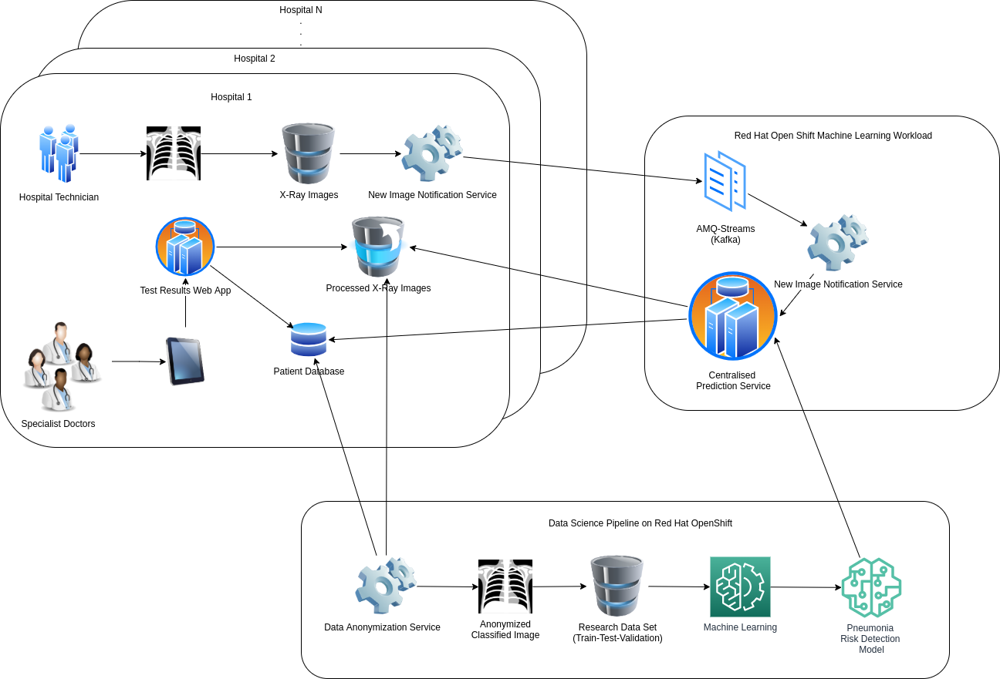
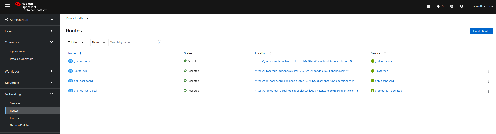
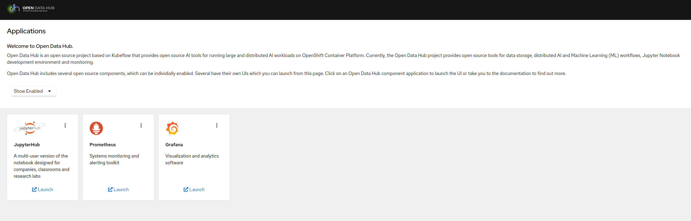
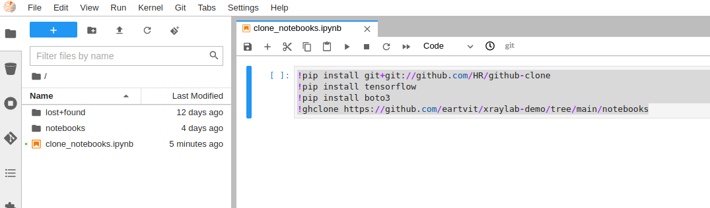

# X-Ray Lab
Showcase of an intelligent application for pneumonia risk detection using Machine Learning model workloads on Red Hat OpenShift.

## Foreword
This showcase is a variant of the one created by Guillaume Moutier which can be found in this repo [Red Hat Data Services - Jumpstart library - XRay Pipeline](https://github.com/red-hat-data-services/jumpstart-library/tree/main/demo1-xray-pipeline), however the focus here is on the developer and data scientist experience for developing and deploying ML models and intelligent applications on Red Hat OpenShift. While several items have been reused (to some extent) from the before mentioned repository, this repository also contains a front end webapp to visualize the results.

The main idea behind this showcase is to demonstrate the end to end capabilities of Red Hat Openshift for developing and deploying integrated Machine Learning workloads.

Please note the solution has been tested on Red Hat OpenShift 4.7.x and 4.8.x and may require some changes on other versions of the platform.

## Let's get started
Recent advances in the field of Machine Learning have made very attractive its use to researchers and developers. One of such advancement is in the image processing and analysis domain and this showcase presents an intelligent application ecosystem that uses Convolutional Neural Networks (CNN) to process labeled x-ray images for pneumonia risk detection purposes to help health practitioners in their daily work (i.e., performing patient triage based on the prediction of the ML model).

### Prerequisites
Please ensure you have the setup as described in the [prerequisites](https://github.com/eartvit/xraylab-demo/tree/main/prerequisites) folder before continuing to the next section.

### Showcase overview
The main idea built by this showcase is an ecosystem consisting of one or several hospitals and a research centre. At the hospitals, technicians take x-ray images and store them with patient and make them ready for interpretation and analysis to the specialist doctors. This process may be automated and improved by using an inteligent application that analyses x-ray images and makes a prediction that may be then used by doctors to perform triage/prioritization of patiens and to increase their throughput. Building such a system may be done using a supervised machine learning approach where existing labeled images may be used for training of a machine learning model that can distinguish between normal or abnormal images (in our case the abnormal is the pneumonia). Patient privacy is maintained by the means of an anonymization process (in our showcase we skip this since for training purposes we used an anonymized Kaggle dataset with labeled [pneumonia](https://www.kaggle.com/paultimothymooney/chest-xray-pneumonia) images. These images are then used to train an ML model that recognizes pneumonia use cases. This model is deployed as service (may be centralized and shared with several hospitals). Different hospitals store their x-ray images on a form of storage (OpenShift Container Storage with Rados GW in our case). Using this type of storage (compatible with AWS S3 Bucket API) a notification service may be created to send a message to a Kafka topic, hosted on OpenShift by using the AMQ Streams (which is RedHat's version of Apache Kafka). As part of the notification message it shall be passed the name of the image, the S3 endpoint (since different hospitals may use different endpoints) and the name of the bucket (among other things). On the centralized location where the pneumonia risk detection machine learning model resides, a [listener application](https://github.com/eartvit/xraylab-demo/tree/main/pneumonia-kafka-lstnr) can be triggered a knative-kafka event from OpenShift to extract the payload to be passed to the pneumonia risk service. The [risk detection service](https://github.com/eartvit/xraylab-demo/tree/main/pneumonia-risk-detection) retrieves the image using the provided information, analyzes it and performs the prediction which is stored in a database (i.e., MySQL) then deletes the image. (Naturally, if the hospital ecosystem and the risk detection application are completely separate then passing back the results should be done by using other micro-services or another Kafka topic - in this showcase this aspect is simplified and skipping ahead to the point where the results are stored in some database). Lastly, a doctor may review the results by the means of a [web app](https://github.com/eartvit/xraylab-demo/tree/main/utils/xrayweb) that exposes patien information, x-ray images, and prediction results (in this showcase the webapp offers minimal functionality just to complete the end-to-end scenario).
The entire concept is depicted in the below diagram:


Random images from the before mentioned Kaggle dataset have then been modified to contain fictional patient information. These images are simulating the x-ray technician's work at a hospital that are uploaded to a source bucket that is being monitored by a listener service that sends notifications to Kafka. In our showcase, this is simulated by the [image-uploader](https://github.com/eartvit/xraylab-demo/tree/main/utils/image-uploader) application.


The purpose of the showcase is to describe the steps required to build the ecosystem implementing the pneumonia risk detection ecosystem and it focuses on the following user stories:
* As a data scientist, I want to develop an image classification model for chest x-ray images using Jupyter Hub (lab/notebooks) as my preferred research environment.
* As a data scientist, I want my model to be deployed quickly so that it may be used by other applications.
* As a (fullstack) developer, I want to have quick access to resources that support the business logic of my applications, including databases, storage, messaging.
* As a (fullstack) developer, I want an automated build process to support new releases/code updates as soon as they are available in a git repository.
* As an operations engineer, I want an integrated monitoring dashboard to new applications available on the (production) infrastructure.

### The Data Scientist user stories details
Data scientists typically use Jupyter Notebooks in order to perform their work. OpenShift's Open Data Hub project makes available several different Jupyter images for this purpose. 
To get started, head to your OpenShift web console and select the project where the Open Data Hub instance has been deployed (see the [prerequisites](https://github.com/eartvit/xraylab-demo/tree/main/prerequisites)). Then go to Networking->Routes and click on the ODH dashboard. From there you have access to Jupyter Hub/Lab (depending on the version of OpenShift and ODH you used either hub or lab are available). 


The first time you instantiate Jupyter it will ask to accept/allow some permissions to be set, then you can create a notebook server (select medium size for this showcase).

Now the environment is prepared to kick-off the work of the data scientists. This showcase stores a sample model training notebook and some additional notebooks required to setup the S3 buckets and the SNS notification service to trigger kafka messages whenever a new image is uploaded to an input bucket. To obtain these notebooks from the current repository, create a new notebook in the Jupyter instance and enter the following commands in a code cell and execute them:
```
!pip install git+git://github.com/HR/github-clone
!pip install tensorflow
!pip install boto3
!ghclone https://github.com/eartvit/xraylab-demo/tree/main/notebooks
```
You should see after the completion of the commands that a new directory `notebooks` has been created within your jupyter hub instance:


Inside the notebooks folder there are three Jupyter notebooks:
* One example of [pneumonia risk detection ML model](https://github.com/eartvit/xraylab-demo/blob/main/notebooks/x-ray-predict-pneumonia-tf-training.ipynb) creation notebook. Here you can see the steps how the sample model was created.
* One [S3 buckets creation](https://github.com/eartvit/xraylab-demo/blob/main/notebooks/s3-buckets.ipynb) notebook. Please use this notebook to create the necessary buckets for simulation of the "production" scenario where the deployed ML model is integrated with the other applications described in the `Showcase overview` section of this readme document (you can run this notebook at this time).
* One [SNS notification](https://github.com/eartvit/xraylab-demo/blob/main/notebooks/create_notifications.ipynb) notebook used to setup the SNS service that shall trigger a new Kafka message every time an x-ray image is uploaded in the source bucket (also used in the "production" scenario). Please do not run this notebook yet as it should be run after the Kafka instance has been created (in the next section).

Naturally, as soon as the datascientist has an ML model ready, it should be deployed to production fast and easy. One way to do this is by using [Seldon](https://www.seldon.io/).
