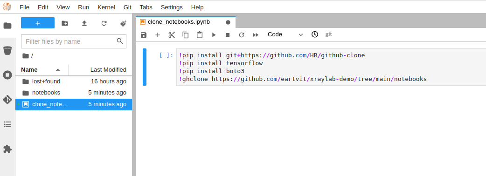
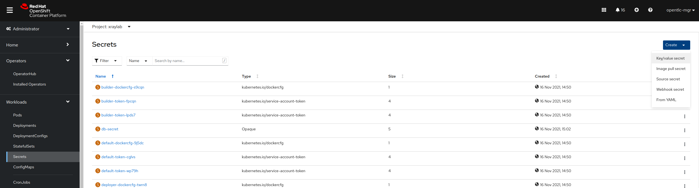
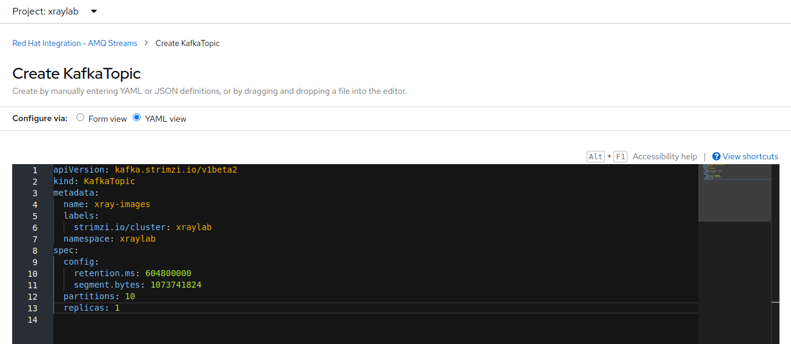
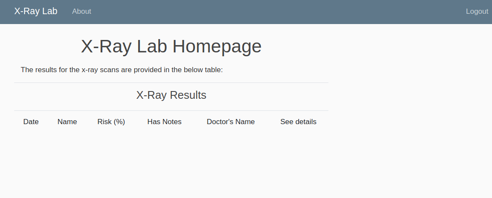
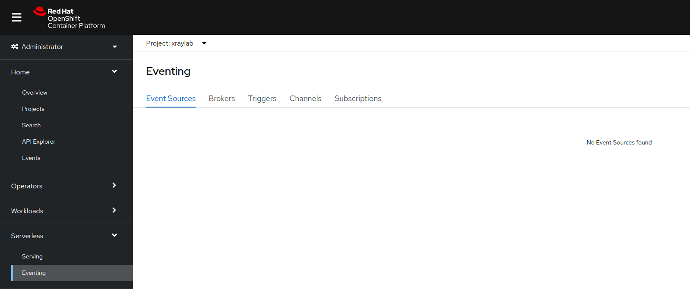
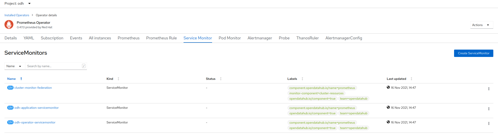

# X-Ray Lab
Showcase of an intelligent application for pneumonia risk detection using Machine Learning model workloads on Red Hat OpenShift.

## Foreword
This showcase is a variant of the one created by Guillaume Moutier which can be found in this repo [Red Hat Data Services - Jumpstart library - XRay Pipeline](https://github.com/red-hat-data-services/jumpstart-library/tree/main/demo1-xray-pipeline), though the focus here is on the developer and data scientist experience for developing and deploying ML models and intelligent applications on Red Hat OpenShift. While several items have been reused (to some extent) from the before mentioned repository, this repository also contains a front end webapp to visualize the results.

The main idea behind this showcase is to demonstrate the end to end capabilities of Red Hat Openshift for developing and deploying integrated Machine Learning workloads.

Please note the solution has been tested on Red Hat OpenShift 4.7.x and 4.8.x and may require some changes on other versions of the platform.

## Let's get started
Recent advances in the field of Machine Learning have made very attractive its use to researchers and developers. One of such advancement is in the image processing and analysis domain and this showcase presents an intelligent application ecosystem that uses Convolutional Neural Networks (CNN) to process labeled x-ray images for pneumonia risk detection purposes to help health practitioners in their daily work (e.g., performing patient triage based on the prediction of the ML model).

### Prerequisites
Please ensure you have the setup as described in the [prerequisites](https://github.com/eartvit/xraylab-demo/tree/main/prerequisites) folder before continuing to the next section.

### Showcase overview
The main idea built by this showcase is an ecosystem consisting of one or several hospitals and a research centre. At the hospitals, technicians take x-ray images and store them with patient information and make them ready to the specialist doctors for interpretation and analysis. This process may be automated and improved by using an inteligent application that analyses x-ray images and makes a prediction that may be then used by doctors to perform triage/prioritization of patiens and to increase their throughput. Building such a system may be done using a supervised machine learning approach where existing labeled images may be used for training of a machine learning model that can distinguish between normal or abnormal images (in our case the abnormal is the pneumonia). Patient privacy is maintained by the means of an anonymization process (in our showcase we skip this since for training purposes we used an anonymized Kaggle dataset with labeled [pneumonia](https://www.kaggle.com/paultimothymooney/chest-xray-pneumonia) images. These images are then used to train an ML model that recognizes pneumonia use cases. This model is deployed as service (may be centralized and shared with several hospitals). Different hospitals store their x-ray images on a form of storage (OpenShift Container Storage with Rados GW in our case). Using this type of storage (compatible with AWS S3 Bucket API) a notification service may be created to send a message to a Kafka topic, hosted on OpenShift by using the AMQ Streams (which is RedHat's version of Apache Kafka). As part of the notification message it shall be passed the name of the image, the S3 endpoint (since different hospitals may use different endpoints) and the name of the bucket (among other things). On the centralized location where the pneumonia risk detection machine learning model resides, a [listener application](https://github.com/eartvit/xraylab-demo/tree/main/pneumonia-kafka-lstnr) can be triggered by a knative-kafka event from OpenShift to extract the payload to be passed to the pneumonia risk service. The [risk detection service](https://github.com/eartvit/xraylab-demo/tree/main/pneumonia-risk-detection) retrieves the image using the provided information, analyzes it and performs the prediction which is stored in a database (e.g., MySQL) then deletes the image. (Naturally, if the hospital ecosystem and the risk detection application are completely separate then passing back the results should be done by using other micro-services or another Kafka topic - in this showcase this aspect is simplified and skipping ahead to the point where the results are stored in some database). Lastly, a doctor may review the results by the means of a [web app](https://github.com/eartvit/xraylab-demo/tree/main/utils/xrayweb) that exposes patien information, x-ray images, and prediction results (in this showcase the webapp offers minimal functionality just to complete the end-to-end scenario).
The entire concept is depicted in the below diagram:


Random images from the before mentioned Kaggle dataset have then been modified to contain fictional patient information. These images are simulating the x-ray technician's work at a hospital that are uploaded to a source bucket that is being monitored by a listener service that sends notifications to Kafka. In our showcase, this is simulated by the [image-uploader](https://github.com/eartvit/xraylab-demo/tree/main/utils/image-uploader) application.


The purpose of the showcase is to describe the steps required to build the ecosystem implementing the pneumonia risk detection ecosystem and it focuses on the following user stories:
* As a data scientist, I want to develop an image classification model for chest x-ray images using Jupyter Hub (lab/notebooks) as my preferred research environment.
* As a data scientist, I want my model to be deployed quickly so that it may be used by other applications.
* As a (fullstack) developer, I want to have quick access to resources that support the business logic of my applications, including databases, storage, messaging.
* As a (fullstack) developer, I want an automated build process to support new releases/code updates as soon as they are available in a git repository.
* As an operations engineer, I want an integrated monitoring dashboard to new applications available on the (production) infrastructure.

### The Data Scientist user stories details
Data scientists typically use Jupyter Notebooks in order to perform their work. OpenShift's Open Data Hub project makes available several different Jupyter images for this purpose. 
To get started, head to your OpenShift web console and select the project where the Open Data Hub instance has been deployed (see the [prerequisites](https://github.com/eartvit/xraylab-demo/tree/main/prerequisites)). Then go to Networking->Routes and click on the ODH dashboard. From there you have access to Jupyter Hub/Lab (depending on the version of OpenShift and ODH you used either hub or lab are available). 


The first time you instantiate Jupyter it will ask to accept/allow some permissions to be set: 

Then you can create a notebook server (select medium size for this showcase).

Now the environment is prepared to kick-off the work of the data scientists. This showcase stores a sample model training notebook and some additional notebooks required to setup the S3 buckets and the SNS notification service to trigger kafka messages whenever a new image is uploaded to an input bucket. To obtain these notebooks from the current repository, create a new notebook in the Jupyter instance and enter the following commands in a code cell and execute them:
```
!pip install git+https://github.com/HR/github-clone
!pip install tensorflow
!pip install boto3
!ghclone https://github.com/eartvit/xraylab-demo/tree/main/notebooks
```
You should see after the completion of the commands that a new directory `notebooks` has been created within your jupyter hub instance:


Inside the notebooks folder there are three Jupyter notebooks:
* One example of [pneumonia risk detection ML model](https://github.com/eartvit/xraylab-demo/blob/main/notebooks/x-ray-predict-pneumonia-tf-training.ipynb) creation notebook. Here you can see the steps how the sample model was created.
* One [S3 buckets creation](https://github.com/eartvit/xraylab-demo/blob/main/notebooks/s3-buckets.ipynb) notebook. Please use this notebook to create the necessary buckets for simulation of the "production" scenario where the deployed ML model is integrated with the other applications described in the `Showcase overview` section of this readme document (you can run this notebook at this time).
* One [SNS notification](https://github.com/eartvit/xraylab-demo/blob/main/notebooks/create_notifications.ipynb) notebook used to setup the SNS service that shall trigger a new Kafka message every time an x-ray image is uploaded in the source bucket (also used in the "production" scenario). Please do not run this notebook yet as it should be run after the Kafka instance has been created (in the next section).

***Note!*** In case you wish to change and retrain the ML model then first you will need to upload the train-test-validation set to the train-test-validation bucket (see [S3 buckets creation](https://github.com/eartvit/xraylab-demo/blob/main/notebooks/s3-buckets.ipynb) for details on how to create the bucket). To upload the images you can do that easily by using the [AWS CLI](https://docs.aws.amazon.com/cli/latest/userguide/cli-chap-welcome.html) as follows:
```shellscript
aws s3 sync --profile=<xraylab_profile_name> --endpoint=<external Rados GW endpoint>  ./<folder> s3://<train-test-validation-bucket>/
```
***Note!*** The above operation should be performed once per dataset: `test`, `train`, and `val` respectively. In other words, the S3 bucket should have in its root at the end of the synchronization three folders: `train`, `test` and `val`. Each of these three folders must contain two subfolders called `NORMAL` and `PNEUMONIA`. These structure is recommended given that the `ImageDataGenerator` from the `tensorflow.keras.preprocessing.image` library is used to prepare the train-test-validation datasets for the model training process. If you do not follow this convention, you must then adapt the model training notebook to meet your setup.

Please note the above command assumes you created a AWS CLI profile using the AWS KEY_ID and SECRET_KEY of the Rados user as explained in the [prerequisites](https://github.com/eartvit/xraylab-demo/tree/main/prerequisites) and you created the train-test-validation bucket as described in the [S3 buckets creation](https://github.com/eartvit/xraylab-demo/blob/main/notebooks/s3-buckets.ipynb) notebook.

Coming back to our datascientist user stories, naturally, as soon as the datascientist has an ML model ready, it wants it deployed to production fast and easy. One way to do this is by using [Seldon](https://www.seldon.io/).
Seldon core comes a packaged web-server exposing endpoints for accessing the prediction function of a model as well as metrics (including custom ones) for the ML model. Seldon also has pre-packaged inference servers meaning that one can deploy a trained model (i.e. from a pickle or h5 file) just by creating a seldon deployment specification yaml file and without writing any additional code. In our use case since we deal with images taking this approach would make the calling service extremely complicated since it would require to receive as input a tensor object (which is a three dimensional matrix). Luckily with Seldon we can create a simple object following a defined pattern recognized by seldon-core in order to expose our model in a simple way. The [TestXray.py](https://github.com/eartvit/xraylab-demo/blob/main/pneumonia-risk-detection/TestXRay.py) in the [pneumonia-risk-detection](https://github.com/eartvit/xraylab-demo/tree/main/pneumonia-risk-detection) folder is in our showcase the implementation of such an extension. In its most basic form, the class exposing the ML model must contain the initializer (`__init__` function), the `predict` function which Seldon binds it to the `/predict` endpoint of the web-service, and the `metrics` function which is bound to the `/metrics` endpoint queried by Prometheus. The metada initializer is an optional function though it's good practice to create it to have an idea what the `/predict` expects as input array. The additional function used in the code is to accomodate the business logic described in the overview section.

Note that the [TestXray.py](https://github.com/eartvit/xraylab-demo/blob/main/pneumonia-risk-detection/TestXRay.py) does not contain any web server specific code since that is handled behind the scenes directly by Seldon. Therefore the datascientist can focus only on what the model requires as input in order to create a prediction.

Now that we have a model trained and a template service created it's time to deploy them. OpenShift has a way of creating container images directly from source code called Source-to-Image (S2I). We shall use this functionality in our showcase to deploy all the applications of the showcase in the next section, the (fullstack) application developer user stories. 

### The (Fullstack) Application Developer user stories details

A developer wants to have quick access to resources including supporting applications required to be integrated with a custom developed application so that the developer can focus most if the time on writing code that fulfills the business logic of a system. OpenShift offers fast provisioning of certain resources for development purposes of databases (using templates) as well as of Kafka instances. 

Another important aspect to keep track of is having configurations to different entities external to an application, and have them shared accross multiple applications. Openshift uses Secrets and ConfigMaps to store secret keys and configuration values shared among applications.
In our showcase we reuse among different applications the following resources:
* the AWS keys from the Rados GW setup (created in the [prerequisites](https://github.com/eartvit/xraylab-demo/tree/main/prerequisites) section).
* the Rados GW endpoint route to make accessible the images
* the database where the pneumonia-risk-service will write predictions and from where the xray webapp shall read results.

Let's create them by selecting the xraylab project as active in Administrator view and then navigate to Workloads->Secrets. Using the Create command (on the right side) select the key/value secret option
 
Below is provided a view for the database secrets. Please create another secret for the AWS keys (using the values you obtained in the prerequisites section)


Next, let's create a configuration map for the S3 buckets endopoint URL followin a similar approach but this time selecting Workloads->ConfigMaps. Note that in the case of ConfigMaps you will need to work with yaml content. Eventually your file should look similar to the one below:


Next, as per our showcase description we need a few other resources before we can continue to application deployment:
* a Kafka instance with a topic where to write the information about the messages dropped in the S3 bucket
* a database where to store the results
* a Kafka source which shall act as a kafka topic listener and consume messages by directing them to an application - this resource we shall create it after we deploy the listener application.

With Red Hat Openshift provisioning a database is fast and easy. Just switch over to developer view and click add and by default the topology view appears with all the deployed applications and services in a selected user namespace. Ensure the selected project is `xraylab` and then click on "Add" from the left menu:

The available DB templates shall appear. For our showcase we shall use MariaDB. Select the template and click on the instantiate button:

Update the service name, connection user name, password, root password and database name to the values you created in the db-secret Secret file.


Wait for the application to be deployed.

Next, we can create our Kafka instance. This also shall be deployed into the `xraylab` project. Head over to Installed Operators and click on the Red Hat Integration - AMQ Streams link: the overview page should appear:

From there you can create an instance by clicking on the create instance tile. You can keep all the defaults, although you may want to rename the cluster name from the default 'my-cluster' to something more meaningful (i.e., xray-images or xraylab).

Please be patient and wait for all the pods to be created (should be 7 in total: 1 entity operator, 3 zookeeper and 3 kafka broker pods). After this step, create a topic for the message notifications from the SNS service (fired whenever a new image is uploaded in the source bucket).
For the topic creation I recommend to switch over to YAML view as it will be easier to change the cluster label (if you did not keep the 'my-cluster' default). Also, note that in this case we need only 1 replica for the topic (for production grade setup it's recommended to have more):


Optionally, you can deploy kafdrop in your project to be able to monitor and perform some administrative operations on the Kafka topics. First, edit the `03_kafdrop.yaml` file and update the name of the kafka broker with the one you provided when you created the Kafka instance (please remember the default name was my-cluster). Please note the value for the Kafka broker connect is the name of the Kafka boostrap service followed by the port number (i.e., ':9092') therefore pay attention to update only the part referring to the broker name while keeping the remainder of the service name (i.e., update only the highlighted portion of the name from the next picture):


Then, you can apply the configuration to OpenShift using:
```shellscript
oc apply -f 03_kafdrop.yaml
```

Let us turn now attention towards the application deployments and let's start with our ML model deployment.
In the Developer view of OpenShift, select the project where you want the application to be deployed (let's assume everything goes to the `xraylab` namespace). Then select add new application and then under the Git Repository section select the `From Dockerfile` tile (given that in our case we have a dockerfile definition for each of the application we are going to deploy).

***Note!*** Source-to-Image (S2I) works also without a Dockerfile, directly with source code and there are several base containers supporting various languages/frameworks. In this showcase the Dockerfile one is presented as it is a very straightforward one considering the applications we want to deploy.

In the next screen fill in the Git repository information (also click on the Show Advanced Git Options link and set the context dir to `/pneumonia-risk-detection` since there it is the Dockerfile which will provide instructions to the S2I builder on how to package the application.

Next, scroll down to to the resources and select Deployment-Config. This will allow you to directly control the application environment and automatically trigger a new build whenever something is changed. Optionally, you can use pipelines if you installed them.
Next, we need to define the route information and the deployment variables. The dockerfile specifies the default 8080 port already so no need to change that. It is however advised to use secure routes. Therefore click on Secure Route checkbox and for TLS termination select "Edge" and "Redirect" for the Insecure Traffic options.

Next, scroll down to the bottom of the page and click on deployment:

Here we can define the environment variable used by the application:

Note that ```storage_ssl_verify``` should be set to ```True``` or ```False``` depending on your clusters registered certificates level of trust. The general case ensuring full compatibility (with less security) is to set it to ```False```.

You can follow the progress of the deployment in the webconsole and once it has completed we need to expose the metrics service point to Prometheus. Please recall that the UI only allowed us to specify one route with one port. Luckily, the second endpoint is internal to OpenShift and only requires an update to the service definition and no need to have an additional route. You can get to the service defition by switching over to the Administrator view and then select Networking->Services where you will see the list of all available services, or from the Topology view, click on the deployment ring of the freshly deployed pneumonia-risk-detection application and then click on the pneumonia-risk-detection service link.

On the service details page, switch to YAML view to edit the service settings. There we need to expose another port where the metrics service is running for the Seldon microservice deployed in the application pod. By default for Seldon this is on port 6000. So let's add another port entry under the spec:ports section for it. Your ports section of the file should look like below:


Click save and reload to ensure your changes are current. Alternatively this verification is visible also by switching back to the Details tab (after the save) where you should see a new entry in the service port mapping area of the web page:


Next, let's deploy, in a similar fashion, the other applications:
* `pneumonia-kafka-lstnr`: this is the service that will receive the Kafka messages from the Kafka xray-images topic. It's purpose is to extract the metadata required by the pneumonia-risk-detection service to perform a prediction: the S3 bucket information (access keys, name, file_name, etc.). These are then transformed into an ndarray type (as JSON payload) as expected by the pneumonia-risk-detection service
* `image-uploader` from the `utils` directory: this application simulates the work of the xray technicians at a hospital. It will look at a predermined bucket with fake_id xray images and push to the input bucket randomly selected images, with a 80/20 ratio of NORMAL vs PNEUMONIA images.
* `xrayweb` from the `utils` directory: this application is a webapp used to showcase a frontend application which may be used by the specialist doctors to view the xray images and their pneumonia risk assessment provided by the ML model.

For the `pneumonia-kafka-lstnr` service, we shall use the Dockerfile based S2i deployment, with a DeploymentConfig option and secure route just as we did for the pneumonia risk detection service. Please make sure you set the context folder value for Git to "/pneumonia-kafka-lstnr". Then, for the Deployment variables set the ones required by the service: region_name, pneumonia_service_endpoint (which is the pneumonia risk detection application endpoint on the /predict resource), and the AWS endpoint credentials:


Because for the target of the kafka listener service we use the internal service route it is safe to use the http request. In fact, using internal service routes are a best practice for inter-service communication inside a kubernetes cluster (not just for OpenShift) as it's not only safe but it also minimizes the external traffic (over the Internet) which may be metered by the cloud provider.

For the `image-uploader` application, all the steps are similar to the ones used by the previous app deployments. Remember to use as context directory for the Git repository settings the "/utils/image-uploader" folder and for the deployment variables set the AWS credentials and access point as well as the source and destination buckets that should be the ones you created with the [S3 buckets creation](https://github.com/eartvit/xraylab-demo/blob/main/notebooks/s3-buckets.ipynb) notebook. Additionally, there is a SECONDS_WAIT variable which initially should be set to zero (0). This will keep the image-uploader from sending images until you change this value to a number (i.e. 2, and then it will send an image every 2 seconds). This is a very convenient way to control application logic without tearing down the deployment.


Now, it's time for the `xrayweb` webapp deployment, which follows through the same steps, having though context Git folder set to "utils/xrayweb", the route set to use secure settings, and using the 8080 port for the service, and the following environment variables set: database connection values (host, user, password, dbname) and S3 access information (key, secret, endpoint and bucket with the images to be evaluated):


Wait for the application to be deployed and then connect to the pod's terminal to initialize the application and its database schema (remember we deployed earlier a database however the sample database 'xraylab' is empty, it does not contain any tables). The `xrayweb` it's a Django based webapp therefore we shall use the Django framework initializers for database and creation of one superuser so that the applcation may be properly used.
Connect to the `xrayweb` webapp's pod terminal and ensure you are in the folder where the `manage.py` file is (by default it should be in "/app"). Initialize the database by running the following command:
```shellscript
python manage.py migrate
```
Once the script completed, create a superuser to access the admin console of the webapp by running the following command in the terminal:
```shelscript
python manage.py createsuperuser
```
The script shall ask you to provide a superuser name and a password. 


After setting the administrator account up, using your web browser, navigate to the route URL of the `xrayweb` application and change the resource to be the "/admin". Use the credentials you've just created to login and create other regular users (i.e. user1, user2) which should act as the usernames used by the specialist doctors.


Log out and then log back in via the default route of the webapp using one of the regular users you just created. At this time the webapp should return an empty result set give that we did not use yet the prediction service.

Before we can view some data here we must do a few more things:
* create a kafka read event for the `xray-images` topic to pass on the messages to the listener service
* create a kafka notification service by executing the [SNS notification](https://github.com/eartvit/xraylab-demo/blob/main/notebooks/create_notifications.ipynb) notebook.
* fire up the image-uploader by changing the SECONDS_WAIT variable's value from 0 to another positive value (can be any real number greater than zero, nevertheless be mindfull of the value you select: if it's too small you might create a high load on Kafka, thus for a typical demonstration I recommend setting the value to be an integer value between 2 and 5).

First, let's setup the notification service, therefore open up in Jupyter the [SNS notification](https://github.com/eartvit/xraylab-demo/blob/main/notebooks/create_notifications.ipynb) notebook and run all the cells.
Then, to create the Kafka read event, we shall use the knative-eventing functionality. Switch to the Administrator view in the OpenShift web console and ensure the current project is still `xraylab`. Then, open up Serverless->Eventing and open the Even Sources tab.

Here, create an event source and select Kafka event source:

You can then use the form or the YAML based view to fill out the required information:
* boostrap server: `<kafka-broker-name>-kafka-boostrap.<namespace>.svc.cluster.local:9092`, which is the kafka boostrap service name and port
* topics, i.e. xray-images
* consumer-group which should be the label of the listener service, i.e. pneumonia-kafka-lstnr
* sink information which is the URI endpoint of the receiving service (the pneumonia-kafka-lstnr) using the following pattern: `http://<listener-svc-name>.<namespace>.svc.cluster.local:8080/` (e.g., http://pneumonia-kafka-lstnr.xraylab.svc.cluster.local:8080/). Note this is the internal name of the service (not an external route), and should NOT be secure http.
* application information which should be the listener application (the groupping will be visible on the Topology view): pneumonia-kafka-lstnr
* name of the source (e.g., kafka-source-xraylab)


Alternatively, the event may be created using a yaml file


Now, all that remains is to trigger some image uploads to the S3 bucket `ml-pneumonia`. To do that, we need to change the value of SECONDS_WAIT of the xray-image-uploader DeploymentConfig. 
Using the OpenShift web console's Administrator view, select the xraylab project as active and navigate to Workloads->DeploymentConfigs and then click on the image uploader deployment configuration then switch to the "Environment" tab where you can update the variable value (e.g. set it to 5 and save it).


Depending on the value you set for SECONDS_WAIT, you should be seeing after that amount of seconds has passed new data in the xrayweb webapp:


### The Operations Engineer user stories details
Now it's time to monitor the service. We shall use for this purpose the Grafana and Prometheus deployments from the Open Data Hub's instance (the `odh` project).
Since the resources we want to monitor are in a different namespace, first we must setup the right ACL for the `odh` namespace to access resources from the `xraylab` namespace. To achieve that we must add a role binding to the `odh` project.
In the Administrator view open User Management->Role Bindings and click on Create binding

On the following screen select a cluster wide role binding. Give a name to the binding, e.g. xraylab-mon-prometheus, select 'view' for the role, and the subject should be ServiceAccount with the namespace where the Prometheus is deployed (odh in our case) and for the subject type in `prometheus-k8s`

For convenience, the same is found in the [04_odh_role_binding.yaml](04_odh_role_binding.yaml) file in this repository, therefore, the role binding can be applied directly from the CLI:
```shellscript
oc project odh
oc apply -f 04_odh_role_binding.yaml
```

Next, we can create a new service monitor for the Prometheus instance from the ODH project (the project where the Open Data Hub instance was created in the [prerequisites](https://github.com/eartvit/xraylab-demo/tree/main/prerequisites) section).
Select Installed Operators and then Prometheus Operator

The view opens up with the Details tab, so switch over to the Service Monitor tab and then click on create ServiceMonitor button:

While you can fill in all the details using the form view, it may be easier to do it by editing directly the YAML file instead.
The contents of the file should be as depicted by the next picture. 

It is extremely important the service monitor has as label `team=opendatahub`, otherwise the ODH Prometheus instance will not add the target to its list of monitored targets. The target is by the selector which shoould be the `pneumonia-risk-detection` service where we defined earlier the `6000-metrics` port as the port where the metrics endpoint shall be exposed.

Next, we can create the Grafana dashboard for this project. This can be done directly from OpenShift by adding the yaml definition of a dashboard, or through the Grafana UI. We shall use the Grafana instance in this case. The default (provisioned) credentials for Grafana are root/secret. They can be viewed in OpenShift on the Workloads->Secrets page under grafana-amin-credentials secrets:

The Grafana dashboard may be accessed via the Networking->Routes section or from the ODH Dashboard. By default you are not logged in and in view mode, so please login first to create the new datasources and then the dashboard.
Now we can create a dashboard for our pneumonia-risk-detection service.
On a new dashboard, add a new panel of type graph and fill in the following for the metrics query:
```
rate(requests_total{service="pneumonia-risk-detection"}[1m])*60
```
Legend should be "requests_total" and min step is 1 (one).
Add two more panels under the current one. The panel type should be stat (in both cases). On the Display side the calculation should be set to Last and Fields pneumonia total and requests total respectively.
Metrics should also be set to `pneumonia_total{service="pneumonia-risk-detection"}` and `requests_total{service="pneumonia-risk-detection"}` respectively. Color mode should be 'value', Graph mode set to 'none' and Alignment set to center. You can also change the text color on the Field tab by selecting the Base color (e.g. red for pneumonia total and green for requests total).

Obviously the values will update depending when and for how long you ran the service.

That's it! You now have gone through the deployment of an intelligent application on RedHat Openshift!


