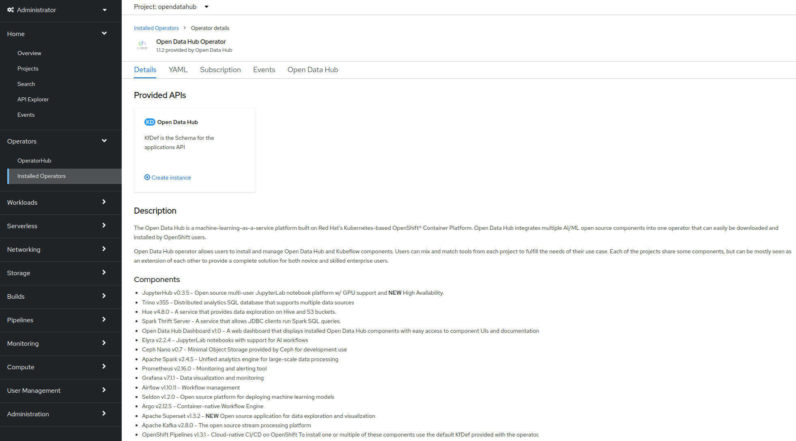

## Prerequisites

### Platform Prerequisites

Have access to a Red Hat OpenShift platform (tested on 4.7.x and 4.8.x). The operator versions mentioned below have been the ones used at the time of writing this document. It is very likely the setup may be executed on newer versions of the operator images.
Install the following operators from Operator hub. Please be patient and wait for each operator to be installed before proceeding to the next one:
* Red Hat OpenShift Serverless (v. 1.18.0)
* OpenShift Container Storage (v. 4.8.3)
* Open Data Hub Operator (v. 1.1.1)
* Red Hat Integration AMQ Streams (v. 1.8.2)
* Red Hat OpenShift Pipelines (v. 1.5.2) - optional, may be used to create automated build/deploy pipelines triggered by Git change web-hooks.

***Note!*** The scenario assumes the use of AWS S3-compatible buckets provided by OpenShift Container Storage. If you want to use regular AWS S3 buckets or other type of storage, please adjust the code of the applications/utilities that require access to storage.

### Configuration

#### Setup KNative Serverless and Eventing
Serverless technology may be used in the final setup of a solution as an alternative to the traditional kubernetes deployments. In this scenario, the components are deployed as regular deployment configurations.
K-Native Eventing is used in the scenario in order to setup a listener for kafka events (created upon new x-ray image upload to a source bucket). 
Using this approach, the kafka consumer is decoupled and abstracted from the business logic of the receiving application.

To setup Serverless, select in the Administrator view of the OpenShift web-console the `knative-serving` project. Go to Installed Operators and click on Red Hat OpenShift Serverless.

Create a Serverless instance using the default values by clicking the create instance link of the KNative Serving tile, and then on the clicking on the Create button in the next screen.


Please wait for the instance to be fully created (depending on your environment it may take a few minutes). Once this process is completed the "Serverless" option should appear populated in the OpenShift web console menu. Note the earlier images already display this information since the screenshot was taken after creation of the services.

Next, to setup eventing, switch to project name `knative-eventing`, then Operators->Installed Operators->Serverless:

Create a KNative Eventing instance using the default values by clicking on the create instance link of the KNative Eventing tile and then on the Create button in the next screen:

Wait for the instance to be fully created! (depending on your environment it may take a few minutes). Once this step is completed then create a Knative Kafka instance. During this step, ensure you enable the Channel and Source for the instance (as depicted in the next figure):

Allow the instance to be fully created before you proceed to the next step (depending on your environment it may take a few minutes).

#### Setup Red Hat Container Storage
Select the `openshift-storage` project (in the Administrator view) and Installed Operators->OpenShift Container Storage and then create an instance. Note the cluster requires three worker nodes for HA purposes so ensure that condition is satisfied. In case you don't have three available nodes, go to Compute and increase the Machine Sets/Machines are needed before provisioning a new Node.
Once you created a cluster please be patient for it to become available (a small cluster of 0.5 TB is sufficient for the purposes of this scenario).
This scenario uses a Rados GW for notifications over the Object Storage. If you are running OpenShift on AWS, OpenShift Container Storage won’t have deployed an ObjectStore and the RadosGateway that is needed for bucket notifications. The definition of it is provided in the [01_cephobjectstore.yaml](01_cephobjectstore.yaml) file.
You can use the openshift client to install everything:
```shellscript
oc apply -f 01_cephobjectstore.yaml
```
Wait for the Object Store to be created; this is done when a pod with "rgw" in its name appears with running state within the openshift-storage project.

***Note!*** If the RGW service was already deployed (when you're not on AWS), it cannot initially be reached from the outside world. Since in the real world the images may be hosted in a different cluster, and as the web-app requires access to these images to display them, an external Route needs to be created for this service (recommended to be a secure route). There are several ways to do this (OpenShift web console or the CLI). Note the last section of the `01_cephobjectstore.yaml` file contains a route definition that may be used as an example in your environment.

##### Deploy Ceph Toolbox
The Ceph toolbox container image contains admin tools that will be used in the next step to create users.
```shellscript
oc patch OCSInitialization ocsinit -n openshift-storage --type json --patch  '[{ "op": "replace", "path": "/spec/enableCephTools", "value": true }]'
```
##### Create a RadosGateway user
Wait for the toolbox to be running before creating a user. The user is created by issueing the following command using the OpenShift CLI:
```shellscript
oc exec -n openshift-storage `oc get pods -n openshift-storage | grep rook-ceph-tools | grep Running | awk '{print $1}'` -- radosgw-admin user create --uid="xraylab" --display-name="Xray Lab"
```
From the output of this command, note and keep the following user informations:

* *access_key*
* *secret_key*


#### Setup Open Data Hub 
Open Data Hub must run in its own namespace. Create a new project called `opendatahub`, select it as active project and then go to Installed Operators->Open Data Hub Operator to create an intance:

As we will use only a few of the ODH components in this showcase, switch to the YAML view and ensure only the following applications are listed under the `spec` tag: odh-common, grafana-cluster, grafana-instance, prometheus-operator, jupyterhub, notebook-images, odh-dashboard. (Please ensure the repos tag is also kept under the spec).

Alternatively, you can create the ODH instance with the help of the oc CLI by applying the [02_opendatahub.yaml](02_opendatahub.yaml) file:
```shellscript
oc apply -f 02_opendatahub.yaml
```

#### Create the project for the showcase
We need a project to deploy the applications from the showcase. The default one is assumed to be xraylab. You may opt for a different name, just make sure you fill in the right name in later steps of the showcase setup.

#### Install Red Hat AMQ Streams Operator
The AMQ Streams Operator is lightweight high-performance, robust messaging platform based on Apache Kafka. Although the documentation suggests a per project installation of the operator, my personal choice is to have a global installation of the operator and then instances may be created separately for different projects. This showcase assumes the AMQ Streams operator has been installed globally in OpenShift and then an instance is created inside the showcase project space (created at the previous step, named ```xraylab```). 
The next picture shows the available operators and their namespaces applicable to this showcase:


